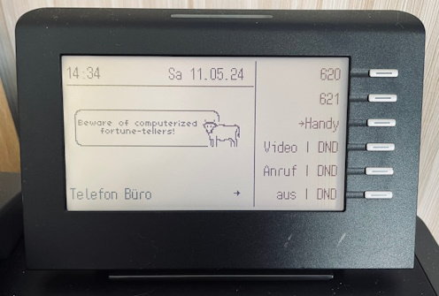

# CowPhone :cow2: :phone:

Got an old OpenStage 40 as your desktop phone? Give it an update and, of course,
some super cow powers!

Just as easy as typing `fortune | cowsay` in the terminal, running this tool in
a Docker container is enough to obtain a fresh fortune cookie once per day (or
anytime you want).

> Fun fact: This was in fact one of the first fortunes I got when implementing
and testing this tool. There's no such thing as coincidence...

Take a look at [this template](./.env.template) and populate your own `.env`
file. Then, simply run `docker compose up -d` etc. and you're all set.

Behind the scenes, the tool launches a local FTP server and generates new
fortune cows as bitmaps following the defined schedule. Then, it requests the
phone to download the bitmaps and use it as its logo.

:cow:
